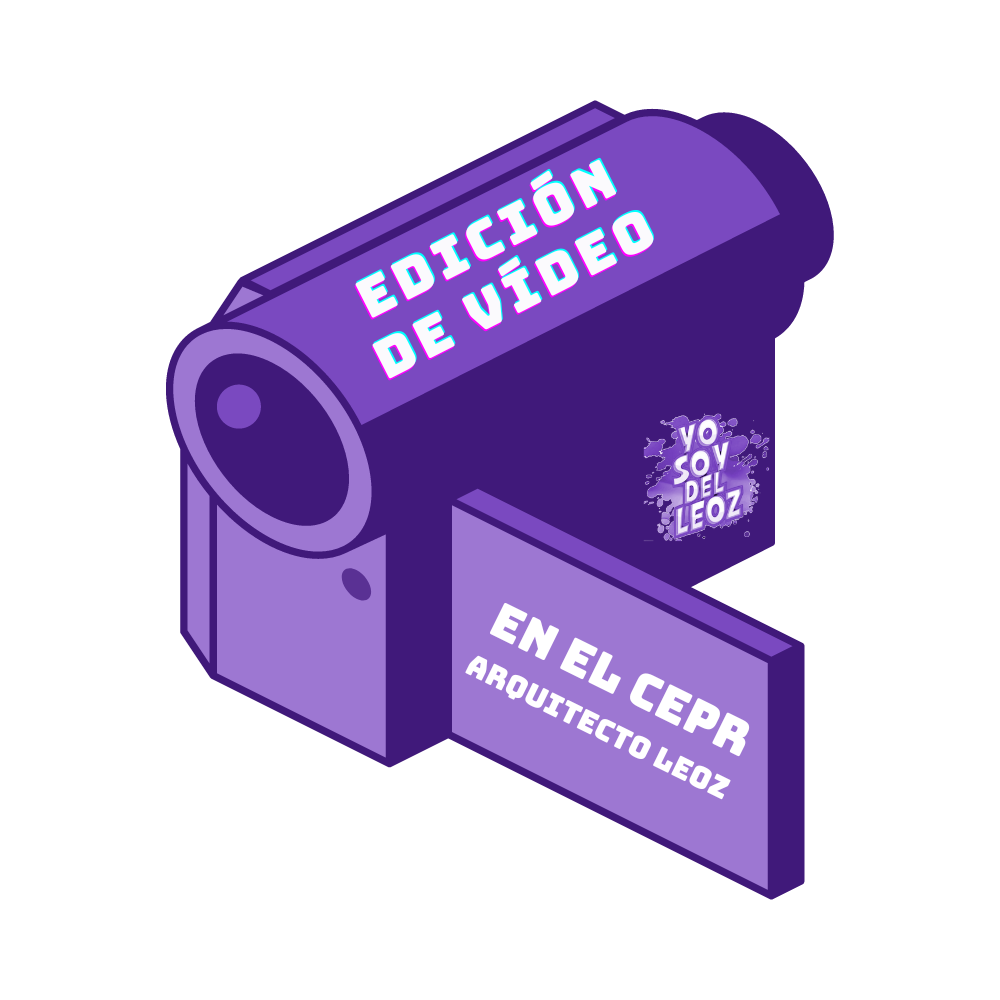
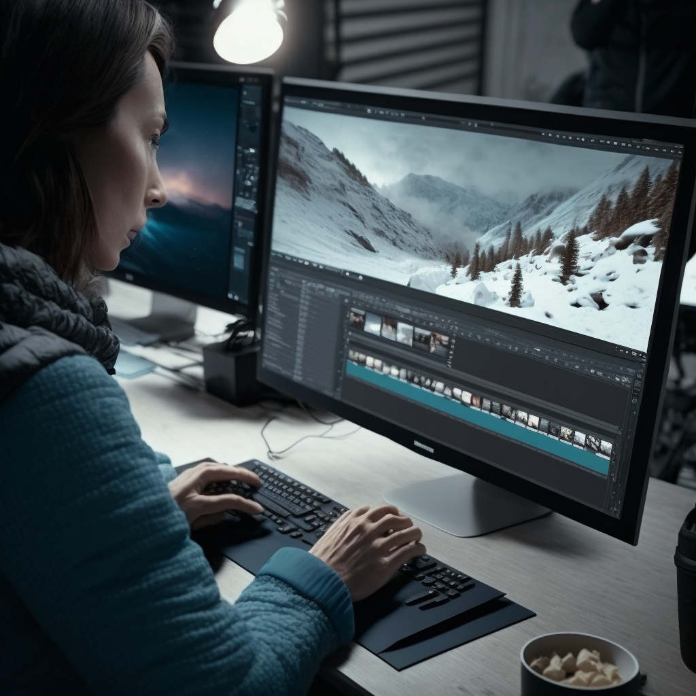
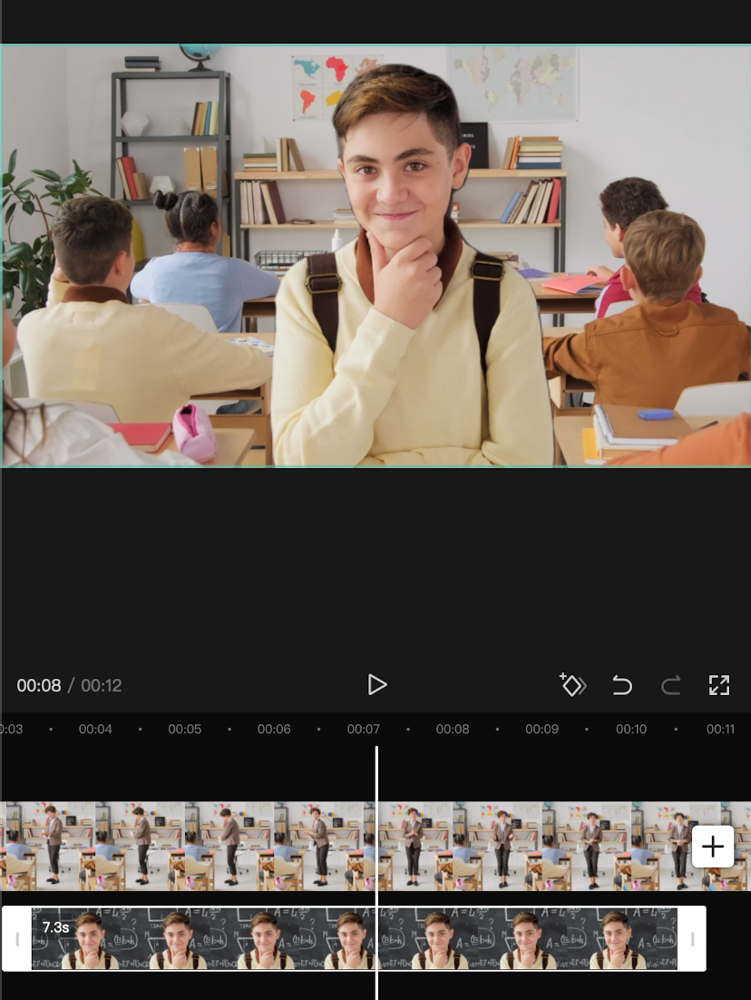
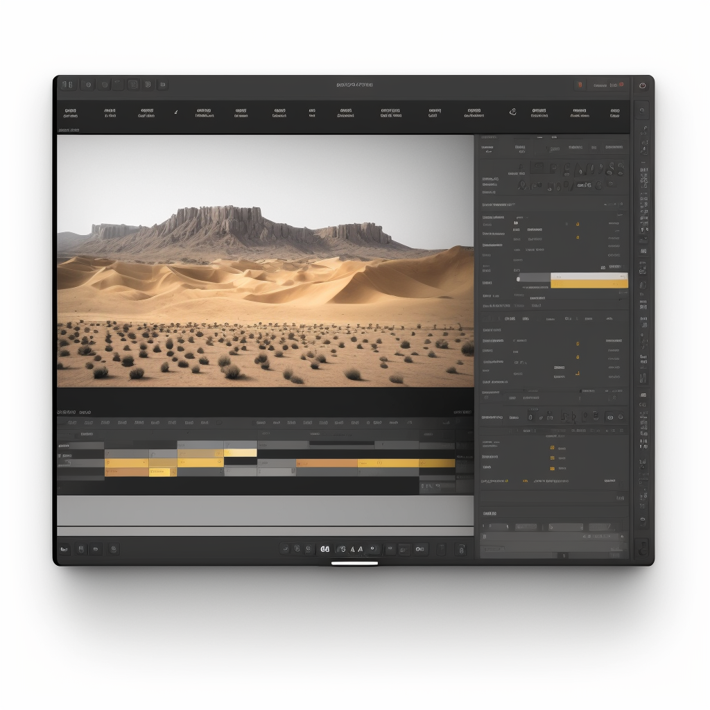

---
## ¿Qué es un vídeo?

<small>1887 - Animal Locomotion</small>

## ¿Cuántas imágenes por segundo se necesitan?

Nuestro cerebro interpreta movimiento a partir de 12 <!-- .element: class="fragment" -->

24fps → Estándar en el cine (en el antiguo era menor) <!-- .element: class="fragment" -->

25fps → Sistema PAL Europeo <!-- .element: class="fragment" -->

29,97fps → Sistema NTSC Americano <!-- .element: class="fragment" -->

60fps → ¿Nuevo estándar? Admitido en Youtube

120fps → Cámara lenta <!-- .element: class="fragment" -->

## La importancia del tamaño

La resolución indica el número de píxeles que tiene un vídeo

Normalmente tienen una proporción de 16:9 o 17:9 en el cine <!-- .element: class="fragment" -->

9:16 en los vídeos verticales de un smartphone <!-- .element: class="fragment" -->

Resoluciones más comunes:

SD (PAL): 720x576 <!-- .element: class="fragment" -->

DVD: 740x480 <!-- .element: class="fragment" -->

HD Ready (720p): 1280x720 <!-- .element: class="fragment" -->

Full HD (1080p): 1920x1080 <!-- .element: class="fragment" -->

2K (UHD): 2048x1080 <!-- .element: class="fragment" -->

4K (UHDV): 3840x2160 <!-- .element: class="fragment" -->

Full 4K (cine): 4096x2160 <!-- .element: class="fragment" -->

8K: 7680x2160 y 8192x4320 <!-- .element: class="fragment" -->
---
## Edición de un vídeo

## Capas VS nodos

## Capas VS nodos

## Flujo de edición

Selección y clasificación del material de grabación <!-- .element: class="fragment" --> 

Normalización <!-- .element: class="fragment" -->

Cortes y orden <!-- .element: class="fragment" -->

Transiciones <!-- .element: class="fragment" -->

Titulaciones <!-- .element: class="fragment" -->

Efectos de vídeo <!-- .element: class="fragment" -->

Música y sonido <!-- .element: class="fragment" -->

Renderización en los formatos necesarios <!-- .element: class="fragment" -->
---
## Herramientas de edición

## Herramientas de edición para móviles

Quik <!-- .element: class="fragment" -->

VN <!-- .element: class="fragment" -->

CapCut <!-- .element: class="fragment" -->

## ¿Cuál es la mejor herramienta?

Cualquiera que se adapte a las necesidades de tu proyecto <!-- .element: class="fragment" -->
---
## Hands on CapCut

<small>capcut.com</small>

## Material de partida

<small>https://drive.google.com/drive/folders/1D_XxAYCTmQjvLmTkCDq2eVi1tBjlZKIT?usp=share_link</small>

## La interfaz de CapCut

Note:

- Gestionar proyectos -> Eliminar marca de agua.
- Vídeos de ayuda.
- Partes pantalla principal: calidad, previsualización, línea de tiempo y menú contextual.
- Movimiento por la línea de tiempo (un dedo y dos).
- Agregar clips (al final o poniendo la línea entre dos clips). Cambiar orden de clips.

## ¡Recortando que es gerundio!

Note:

- Recorte de clips -> Arrastrando bordes o cortando con trim y eliminando.

## De uno a otro: La transición

Note:

- Transiciones y animaciones.

## Texto everywhere

Note:

- Añadir texto y opciones. Texto a voz.
- Añadir stickers y usarlos para seguimiento.

## Una mijita de retoque

Note:

- Pestaña de efectos (vídeo, corporales) y filtros (ajustar). Hacerlo con sentido.
- Eliminar fondo
- Superposiciones (la que está debajo por arriba) con fundidos

## ¿Qué es eso que se escucha?

Note:

- Agregar sonidos en Audio.
- Al seleccionar audio: volumen, desvanecer (fade in-out), dividir, velocidad y corte paralelo (genera puntos en función de melodía o ritmo).
- Texto a voz

## ¡Me lo llevo!

Note:

- Crear portada.
- Exportar.
---
## Nuestra carrera, nuestro proyecto

## Guías de ayuda
---
## Ticket de salida

<small>https://app.wooclap.com/FNRJUJ/questionnaires/63d5b54091ba9479825575b5</small>
---

<!-- .slide: data-background-video="../assets/video-edition.mp4" data-background-opacity="0.6" data-background-video-loop data-background-video-muted -->

## ¿Dudas?