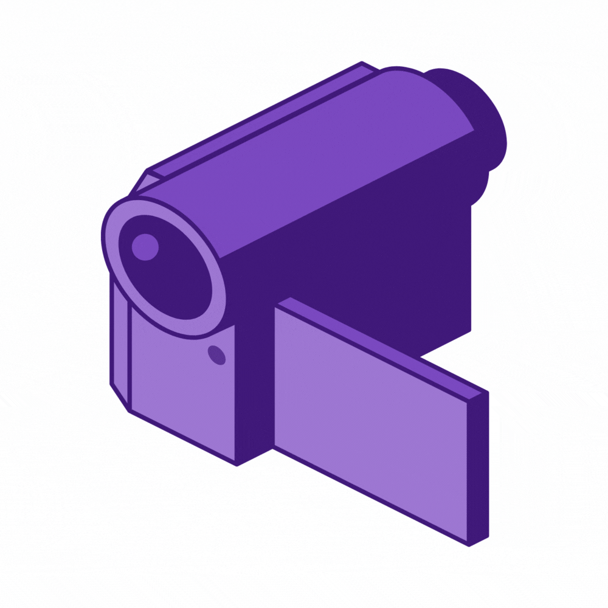
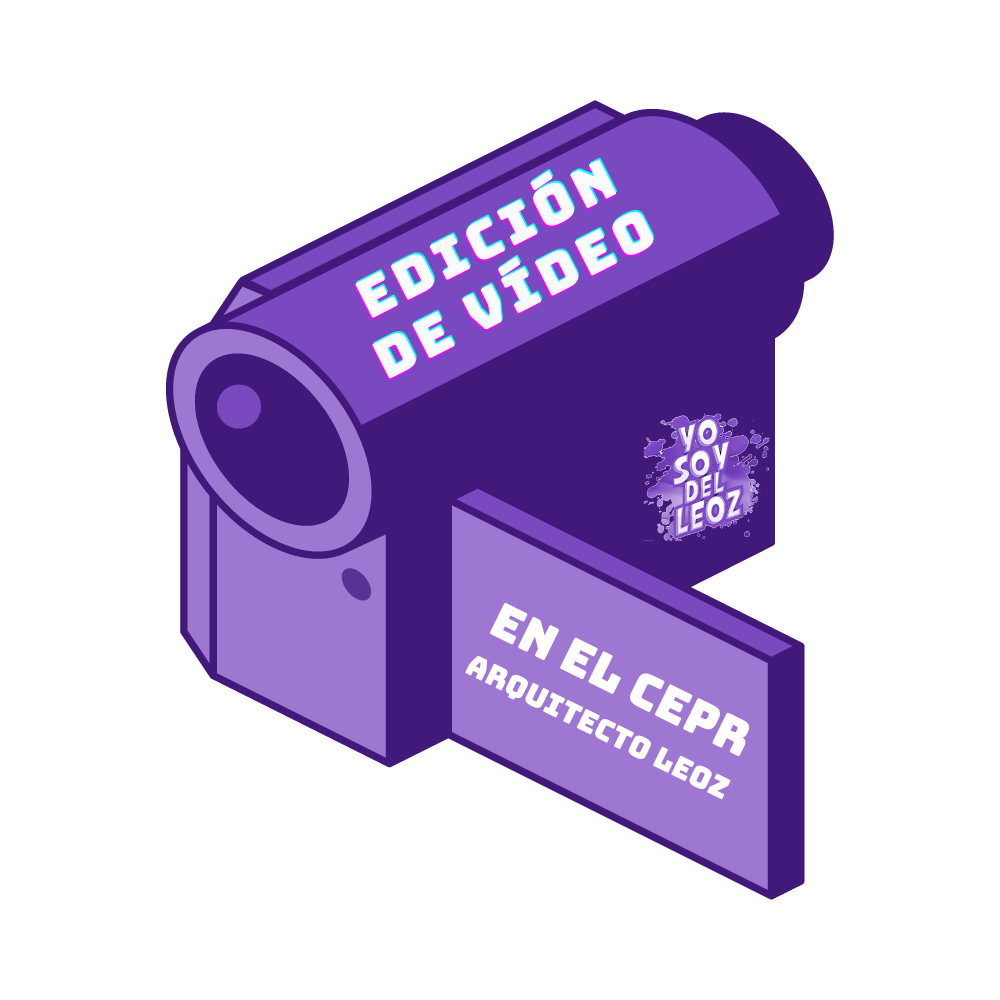
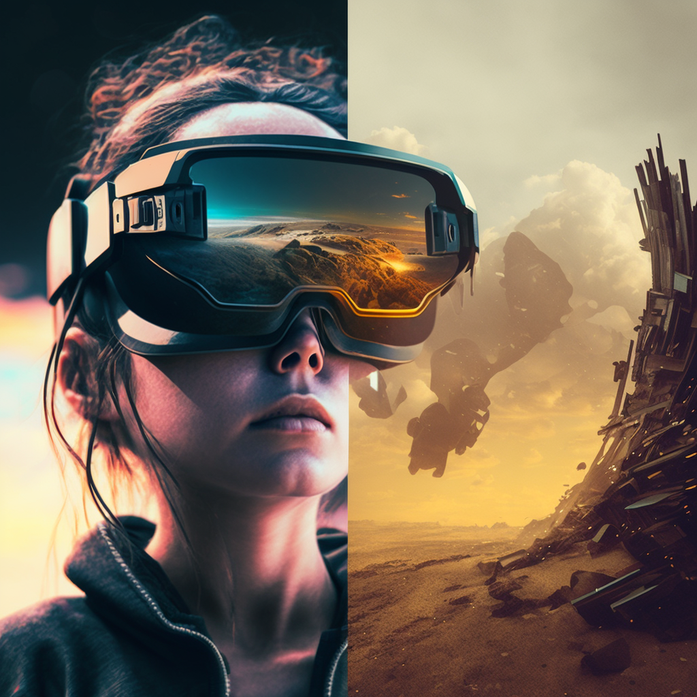
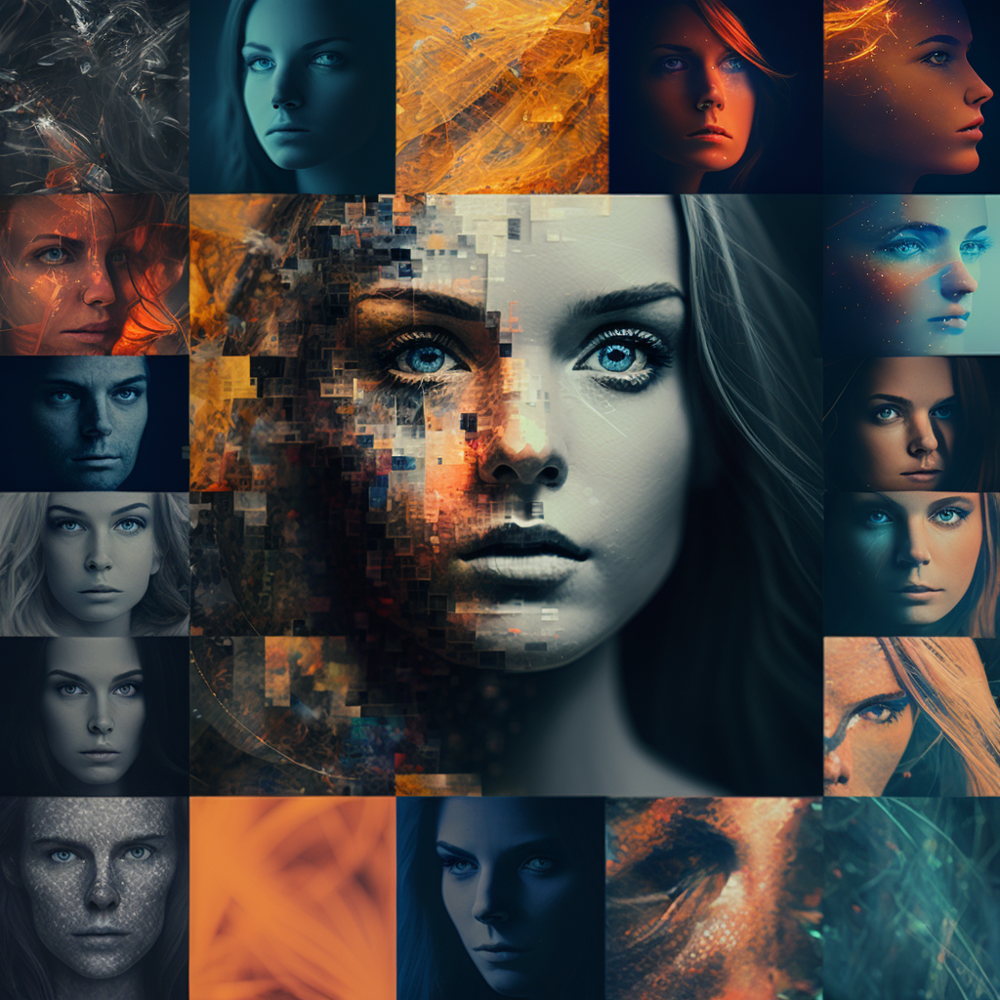
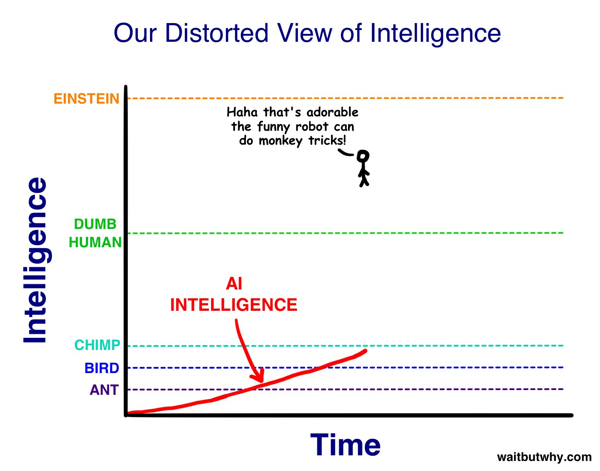

---
## Recordemos

<small>capcut.com</small>

## Guías de ayuda

<small>https://davidlms.github.io/formacion-profesorado-edicion-video-cepr-arquitecto-leoz/guides/</small>
---
## Edición de vídeo en el escritorio

Es posible usar CapCut

Usaremos Kdenlive v22.04.3
---
## ¿Bienvenidos al futuro?

## Tecnologías llamadas a cambiarlo todo

XR (Realidad extendida) <!-- .element: class="fragment" -->

IA (Inteligencia Artificial) <!-- .element: class="fragment" -->

## XR - AR y VR

Del cine

[a casa](https://player.vimeo.com/video/539044416?autoplay=1&color=2d67cc&autopause=0&loop=1&muted=1&title=0&portrait=0&byline=0#t=) ([CamTrackAR](https://fxhome.com/product/camtrackar))

Y también [completamente virtual](https://www.youtube.com/watch?v=MKBVNImcM6Q)

## Inteligencias Artificiales

## Expectativa

<small>[Fuente: waitbutwhy.com](https://waitbutwhy.com/2015/01/artificial-intelligence-revolution-1.html)</small>

## Realidad

<small>[Fuente: waitbutwhy.com](https://waitbutwhy.com/2015/01/artificial-intelligence-revolution-1.html)</small>

## Un ejemplo de aplicación
  
<video width="640" height="480" controls>
  <source src="../assets/aplicacion-ia-video-dotcsv.mp4" type="video/mp4">
Tu navegador no soporta la etiqueta de reproducción de vídeos.
</video>

<small>[Fuente: @DotCSV](https://twitter.com/DotCSV/status/1520097583930224640) Abril 2022</small>

## ¿Qué podremos hacer pronto?

Imagina un vídeo...

[GPT-4](https://openai.com/product/gpt-4) genera el texto

[VALL-E](https://valle-demo.github.io) clona tu voz (y a varios idiomas gracias a [VALL-E X](https://vallex-demo.github.io))

[DeepStory](https://www.myheritage.es/deepstory) o [Synthesia.io](https://www.synthesia.io) da vida a tu avatar

[DALL-E](https://openai.com/product/dall-e-2)/[Stable Diffusion](https://stability.ai/blog/stable-diffusion-public-release)/[Midjourney](https://www.midjourney.com) genera las imágenes

[ControlNet](https://github.com/lllyasviel/ControlNet) modifica las imágenes

[Descript](https://www.descript.com) modifica tu discurso

<video src="https://d3phaj0sisr2ct.cloudfront.net/research/Gen2.mp4" width="640" height="480" controls></video>

<small>6 febrero 2023 - Gen-2</small>

## ¿Y las grabaciones? ¿Dónde queda el arte?

[El CGI al alcance de todos/as](https://player.vimeo.com/video/805754885?portrait=0&byline=0&title=0)

<video width="640" height="480" controls>
  <source src="../assets/EC84132E-3E04-41EC-8D8F-6854610DF8EC.mp4" type="video/mp4">
Tu navegador no soporta la etiqueta de reproducción de vídeos.
</video>
---
## Ticket de salida

<small>https://app.wooclap.com/FNRJUJ/questionnaires/6431fcad71aa831e6133ffff</small>
---

<!-- .slide: data-background-video="../assets/video-edition.mp4" data-background-opacity="0.6" data-background-video-loop data-background-video-muted -->

## ¿Dudas?
